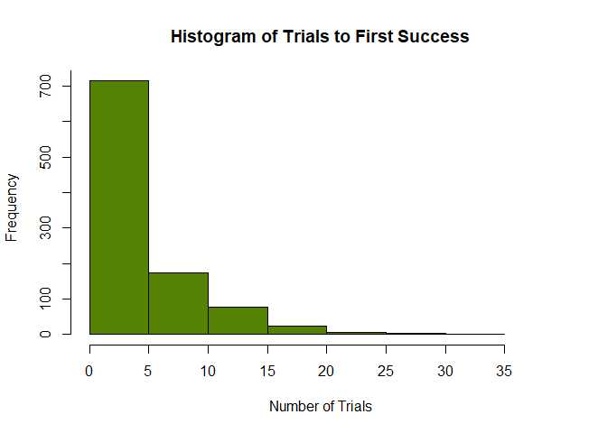

## Geometric Distribution. Provide an R code for the geometric distribution. The geometric distribution is a probability distribution that models the number of trials required to achieve the first success in a sequence of Bernoulli trials, where each trial has a constant probability of success.

1.  Set the probability of success: p &lt;- 0.2

<!-- -->

    p <- 0.2

1.  Generate 1000 random variables from the geometric distribution.

<!-- -->

    x <- rgeom(1000, p)

1.  Calculate some basic statistics: mean\_x &lt;- mean(x), var\_x &lt;-
    var(x), sd\_x &lt;- sd(x)

<!-- -->

    mean_x <- mean(x)
    var_x <- var(x)
    sd_x <- sd(x)

1.  Print the results in item 3 with the following output (string):
    Number of trials required to achieve first success, Mean (in 2
    decimal places), Variance (in 2 decimal places), Standard deviation
    ( in 2 decimal places)

<!-- -->

    cat("Number of trials required to achieve first success:\n")

    ## Number of trials required to achieve first success:

    cat("Mean:", round(mean_x, 2))

    ## Mean: 4.34

    cat("\nVariance:", round(var_x, 2))

    ## 
    ## Variance: 23.43

    cat("\nStandard Deviation:", round(sd_x, 2))

    ## 
    ## Standard Deviation: 4.84

1.  Plot the histogram of the results.

<!-- -->

    hist(x, main = "Histogram of Trials to First Success", xlab = "Number of Trials",
        col = "#568203", xlim = c(0, max(x) + 5), xaxt = "n", yaxt = "n")
    axis(side = 1, at = seq(0, max(x) + 5, by = 5))
    axis(side = 2, at = seq(0, 800, by = 100))

## Hypergeometric Distribution. Consider a plant manufacturing IC chips of which 10% are expected to be defective. The chips are packed in boxes for export. Before transportation, a sample is drawn from each box. Estimate the probability that the sample contains more than 10% defectives, when:

1.  A sample of 10 is selected from a box of 40

<!-- -->

    q <- 1  #10%
    k <- 10  #sample
    m <- 40 * 0.1  #10% of 40 - defective
    n <- 40 * 0.9  #90% of 40 - non defective

    ans <- round(phyper(q, m, n, k), 4)
    cat("Probability that the sample contains more than 10% defectives: ", ans *
        100, "%", sep = "")

    ## Probability that the sample contains more than 10% defectives: 74.41%

1.  A sample of 10 is selected from a box of 5000

<!-- -->

    q <- 1  #10%
    k <- 10  #sample
    m <- 5000 * 0.1  #10% of 5000 - defective
    n <- 5000 * 0.9  #90% of 5000 - non defective

    ans <- round(phyper(q, m, n, k), 4)
    cat("Probability that the sample contains more than 10% defectives: ", ans *
        100, "%", sep = "")

    ## Probability that the sample contains more than 10% defectives: 73.61%
